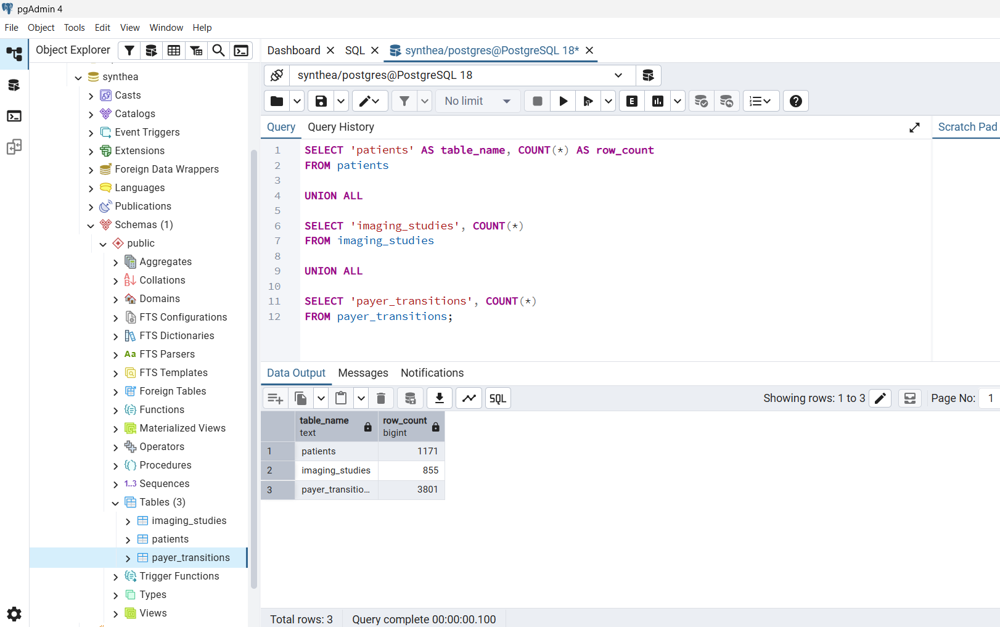
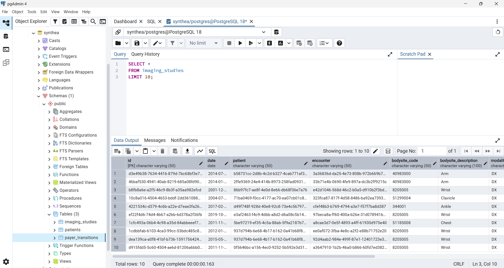
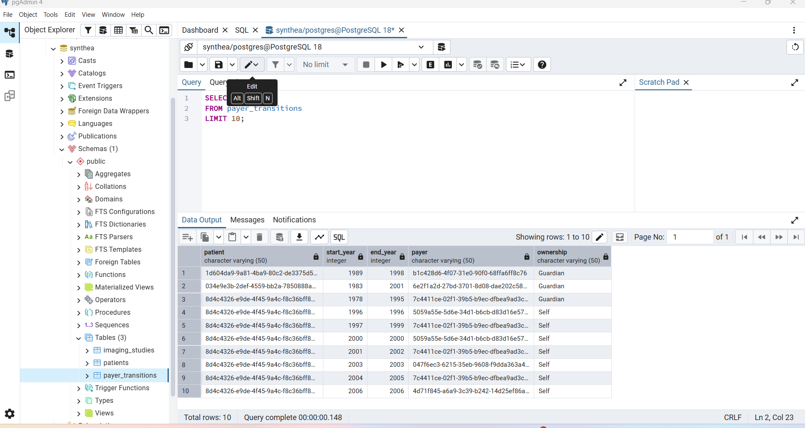
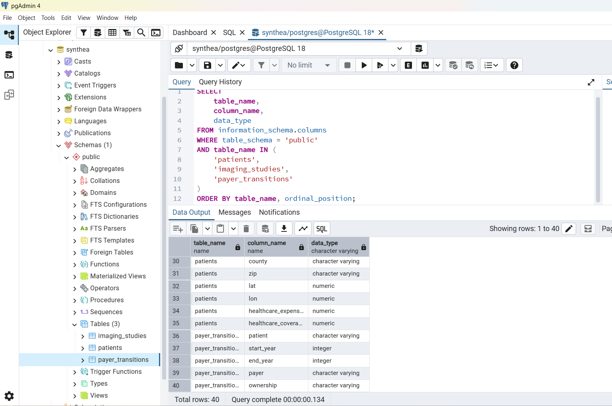
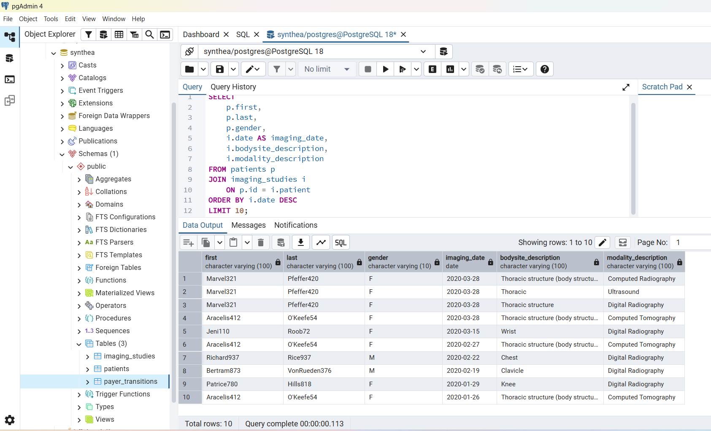
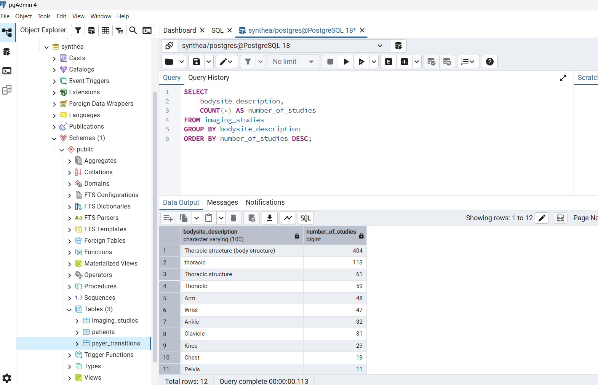
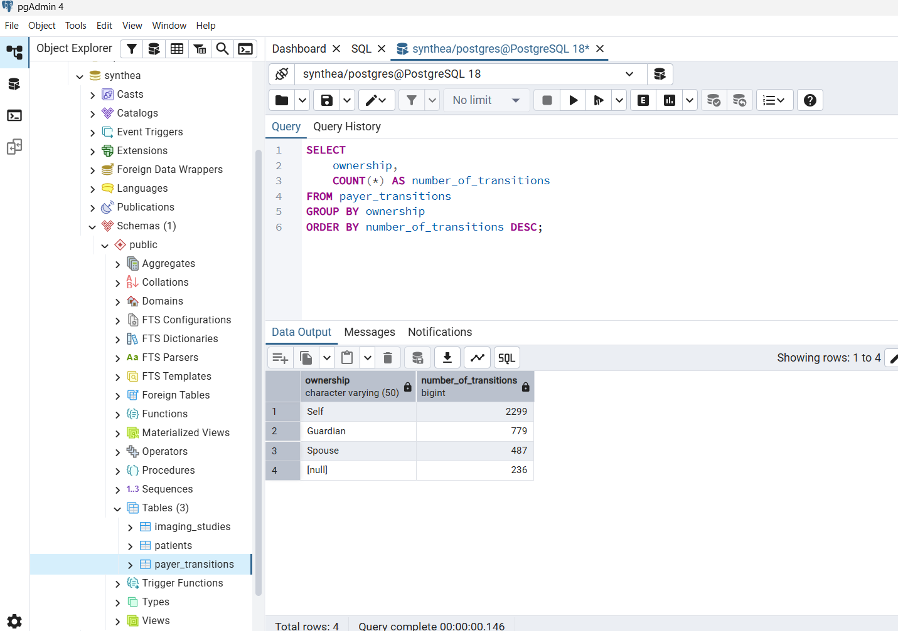
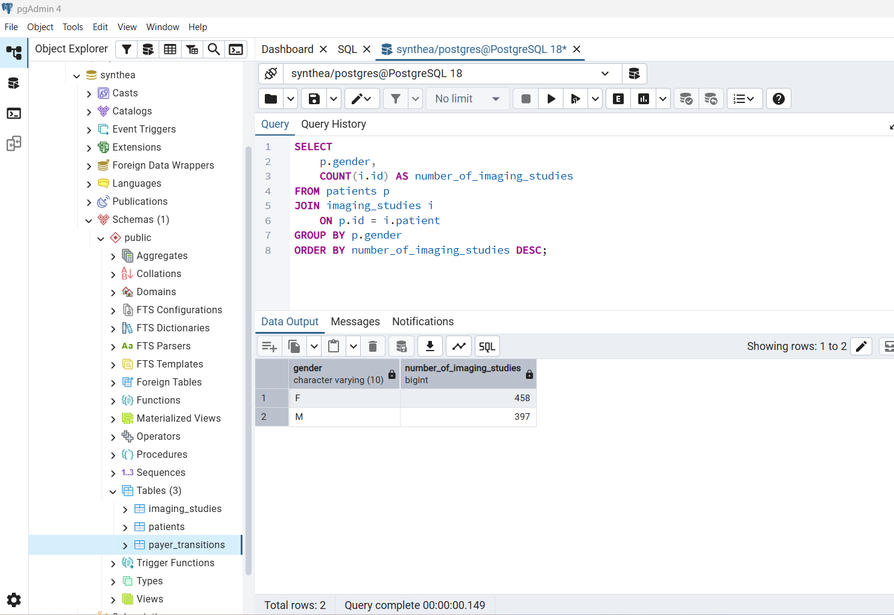

# Module 7 - Final Project - Synthea Healthcare Database

- Name: Aanchal Gupta
- Course: Database for Analytics
- Module: 6

## Project Overview

For my final project, I created a PostgreSQL healthcare database using data from the Synthea synthetic patient dataset. I selected three related CSV files: patients, imaging studies, and payer transitions. I chose these datasets because they met the project size requirements and could be related using a common patient identifier.

The final database contains three tables:

| Table | Rows | Columns |
|---|---:|---:|
| patients | 1,171 | 25 |
| imaging_studies | 855 | 10 |
| payer_transitions | 3,801 | 5 |

The database contains string, numeric, integer, and date data types. The imaging studies and payer transitions tables can be connected to the patients table using the patient ID.

## Data Source : https://synthetichealth.github.io/synthea/#about-landing

The data used for this project comes from Synthea, an open-source synthetic patient data generator. Synthea provides realistic but synthetic healthcare records that can be used for research and data analysis without using real patient information.

The original dataset was downloaded in CSV format. The complete download contained multiple healthcare-related files, including patients, encounters, conditions, medications, imaging studies, payer transitions, and other clinical data.

For this project, I selected the following three files:

- `patients.csv`
- `imaging_studies.csv`
- `payer_transitions.csv`

I selected these files after reviewing the available datasets, their sizes, columns, and relationships. The three selected files provided enough records for the project requirements while remaining manageable to import and analyze in PostgreSQL.

## Database Verification


```sql
SELECT 'patients' AS table_name, COUNT(*) AS row_count
FROM patients

UNION ALL

SELECT 'imaging_studies', COUNT(*)
FROM imaging_studies

UNION ALL

SELECT 'payer_transitions', COUNT(*)
FROM payer_transitions;
```




## Viewing the Imported Data

After importing the CSV files, I queried each table to verify that the records were loaded correctly. I used `LIMIT 10` so that a small sample of each table could be displayed clearly.

### Patients

```sql
SELECT *
FROM patients
LIMIT 10;
```


### Imaging Studies

```sql
SELECT *
FROM imaging_studies
LIMIT 10;
```



### Payer Transitions

```sql
SELECT *
FROM payer_transitions
LIMIT 10;
```



## Data Dictionary

The following data dictionary describes the attributes used in each of the three tables in the Synthea database.


### Patients Table

The `patients` table contains demographic, location, and healthcare cost information for each patient.

| Column | Data Type | Description |
| --- | --- | --- |
| id | VARCHAR | Unique patient identifier |
| birthdate | DATE | Patient's date of birth |
| deathdate | DATE | Patient's date of death, if applicable |
| ssn | VARCHAR | Synthetic Social Security number |
| drivers | VARCHAR | Synthetic driver's license identifier |
| passport | VARCHAR | Synthetic passport identifier |
| prefix | VARCHAR | Name prefix |
| first | VARCHAR | First name |
| last | VARCHAR | Last name |
| suffix | VARCHAR | Name suffix |
| maiden | VARCHAR | Maiden name, if applicable |
| marital | VARCHAR | Marital status |
| race | VARCHAR | Patient race |
| ethnicity | VARCHAR | Patient ethnicity |
| gender | VARCHAR | Patient gender |
| birthplace | VARCHAR | Patient birthplace |
| address | VARCHAR | Street address |
| city | VARCHAR | City |
| state | VARCHAR | State |
| county | VARCHAR | County |
| zip | VARCHAR | ZIP code |
| lat | NUMERIC | Latitude |
| lon | NUMERIC | Longitude |
| healthcare_expenses | NUMERIC | Patient healthcare expenses |
| healthcare_coverage | NUMERIC | Patient healthcare coverage |


### Imaging Studies Table

The `imaging_studies` table contains information about imaging procedures associated with patients.

| Column | Data Type | Description |
|---|---|---|
| id | VARCHAR | Unique imaging study identifier |
| date | DATE | Date of the imaging study |
| patient | VARCHAR | Patient identifier used to relate the study to the patients table |
| encounter | VARCHAR | Identifier for the associated healthcare encounter |
| bodysite_code | VARCHAR | Code representing the body site examined |
| bodysite_description | VARCHAR | Description of the body site examined |
| modality_code | VARCHAR | Imaging modality code |
| modality_description | VARCHAR | Description of the imaging modality |
| sop_code | VARCHAR | SOP/DICOM-related imaging code |
| sop_description | VARCHAR | Description associated with the SOP code |


### Payer Transitions Table

The `payer_transitions` table contains information about changes in payer coverage for patients over time.

| Column | Data Type | Description |
|---|---|---|
| patient | VARCHAR | Patient identifier used to relate the record to the patients table |
| start_year | INTEGER | Beginning year of the payer coverage period |
| end_year | INTEGER | Ending year of the payer coverage period |
| payer | VARCHAR | Identifier for the payer |
| ownership | VARCHAR | Relationship or ownership category for the insurance coverage |


## Database Relationships

The three tables are related through the patient identifier. The `id` column in the `patients` table identifies each patient, while the `patient` column in both `imaging_studies` and `payer_transitions` refers to the corresponding patient.

The relationship can be represented as:

patients.id → imaging_studies.patient

patients.id → payer_transitions.patient

This structure allows patient demographic information to be combined with imaging and payer information using SQL JOIN operations.


## Table Structure and Data Types

I used PostgreSQL data types based on the type of information stored in each column. The database includes `VARCHAR` for text data, `DATE` for dates, `INTEGER` for year values, and `NUMERIC` for numerical values such as latitude, longitude, healthcare expenses, and healthcare coverage.

I used the following query to verify the structure and data types of all three tables:

```sql
SELECT
    table_name,
    column_name,
    data_type
FROM information_schema.columns
WHERE table_schema = 'public'
AND table_name IN (
    'patients',
    'imaging_studies',
    'payer_transitions'
)
ORDER BY table_name, ordinal_position;
```




## SQL Analysis

### Query 1 - Join Patients and Imaging Studies

I joined the `patients` and `imaging_studies` tables using the patient ID. This allows patient demographic information to be connected with the patient's imaging records.

```sql
SELECT
    p.first,
    p.last,
    p.gender,
    i.date AS imaging_date,
    i.bodysite_description,
    i.modality_description
FROM patients p
JOIN imaging_studies i
    ON p.id = i.patient
ORDER BY i.date DESC
LIMIT 10;
```



This query verified that the patient identifiers in the two tables could be successfully related and allowed me to view patient information together with imaging details.

### Query 2 - Imaging Studies by Body Site

I used `GROUP BY` with `COUNT(*)` to determine how many imaging studies were associated with each body site.

```sql
SELECT
    bodysite_description,
    COUNT(*) AS number_of_studies
FROM imaging_studies
GROUP BY bodysite_description
ORDER BY number_of_studies DESC;
```



The results showed that "Thoracic structure (body structure)" was the most frequent description with 404 studies. Other common values included "thoracic" with 113 studies and "Thoracic structure" with 61 studies.

I also noticed that similar body sites were represented using different descriptions and capitalization, such as "thoracic", "Thoracic", and "Thoracic structure". This showed me that even structured datasets may require additional cleaning and standardization before analysis.

### Query 3 - Payer Transitions by Ownership

I grouped the payer transition records by ownership to understand which ownership categories appeared most frequently.

```sql
SELECT
    ownership,
    COUNT(*) AS number_of_transitions
FROM payer_transitions
GROUP BY ownership
ORDER BY number_of_transitions DESC;
```



The results showed 2,299 records with Self ownership, 779 with Guardian ownership, and 487 with Spouse ownership. There were also 236 records where ownership was missing. This was another example of a data-quality issue that should be considered during analysis.

### Query - Imaging Studies by Gender

For a more advanced analysis, I combined a `JOIN`, `GROUP BY`, and aggregate function. I joined patients with imaging studies and counted the number of imaging studies by gender.

```sql
SELECT
    p.gender,
    COUNT(i.id) AS number_of_imaging_studies
FROM patients p
JOIN imaging_studies i
    ON p.id = i.patient
GROUP BY p.gender
ORDER BY number_of_imaging_studies DESC;
```



The query returned 458 imaging studies associated with female patients and 397 associated with male patients. Together, these total 855 records, which also matches the total number of records in the `imaging_studies` table.

## Data Import and Transformation Process

The original data was obtained from the Synthea sample healthcare dataset in CSV format. I selected three related files: `patients.csv`, `imaging_studies.csv`, and `payer_transitions.csv`. I chose these tables because they met the project row requirements while also allowing the data to be connected through patient identifiers.

I first reviewed the CSV files in Excel to understand their columns and determine appropriate PostgreSQL data types. I then created a `synthea` database in PostgreSQL and created three tables that matched the structure of the CSV files.

The CSV files were imported into the corresponding PostgreSQL tables using pgAdmin. After importing the data, I used `COUNT(*)`, `SELECT *`, and queries against `information_schema.columns` to verify that the data and table structures were loaded correctly.

The final database contains:

- `patients` - 1,171 rows
- `imaging_studies` - 855 rows
- `payer_transitions` - 3,801 rows

The database includes several data types, including `VARCHAR`, `DATE`, `INTEGER`, and `NUMERIC`, satisfying the project requirements.

## Challenges and Solutions

One of my first challenges was choosing a dataset that met all of the project requirements. The Synthea download contained many CSV files with different sizes and structures, so I had to examine several files before deciding which ones would work well together. I selected patients, imaging studies, and payer transitions because they had enough records for the assignment and could be related using patient identifiers.

Another challenge was determining the correct table structure and data types before importing the CSV files. I reviewed the files in Excel first and created the PostgreSQL columns using appropriate types such as VARCHAR, DATE, INTEGER, and NUMERIC.

I also encountered an import failure while loading the patient data into PostgreSQL. I reviewed the table structure and import settings and corrected the issue before importing the data successfully. Afterward, I verified the imports using row counts and sample queries.

Finally, understanding how the tables were related required examining the columns in each dataset. I found that `patients.id` could be matched with the `patient` column in `imaging_studies` and `payer_transitions`. This allowed me to create JOIN queries and analyze information across multiple tables.

## Insights Gained

Working with the Synthea healthcare data showed me how separate healthcare datasets can be connected to answer analytical questions. For example, joining the patients and imaging studies tables allowed me to compare imaging activity with patient demographics.

The analysis also revealed data-quality considerations. Similar imaging body sites appeared under slightly different descriptions, and some payer transition records had missing ownership values. These findings showed me why data verification and cleaning are important before performing further analysis.

Overall, this project helped me understand the complete database workflow: locating raw data, reviewing its structure, selecting appropriate data types, importing it into PostgreSQL, validating the records, relating tables, and using SQL to generate useful information.

## Conclusion

I successfully created a PostgreSQL healthcare database using three related Synthea datasets. The final database met the required table sizes and contained string, numeric, and date data types. I verified the imported data and used joins, grouping, and aggregate functions to analyze relationships within the dataset.

This project gave me practical experience working with a real-world-style healthcare dataset and helped bring together the PostgreSQL and SQL concepts covered throughout the course.